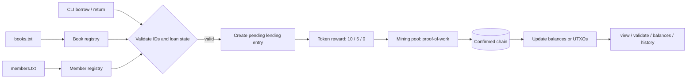

# System Design



## Design goals

The system models a library ledger that behaves like a blockchain network:

1. Borrowing and returning books create pending lending events instead of instant ledger finalization.
2. A return event creates a token reward and attaches a transaction ID.
3. Mining confirms the pending entries and adds them to the canonical chain.
4. Rewards are applied only after successful confirmation.
5. The same blockchain record can be interpreted under either UTXO or account-balance semantics.

## Pending pool and block structure

Each pending record stores:

- index
- timestamp
- book id/title
- member id/name
- action
- token reward
- transaction ID

Confirmed blocks extend the earlier structure with:

```text
index | timestamp | book_id | book_title | member_id | member_name |
action | token_reward | transaction_id | previous_hash | nonce | signature | hash
```

The genesis block has index `0`. Hashes are recomputed with a configurable proof-of-work difficulty. Each block includes the previous block hash, forming a chain so any mutation breaks the integrity check.

## Transaction models

### UTXO model

- UTXOs are stored as unspent outputs tied to a member.
- Each member balance is computed from all unspent outputs.
- Reward transactions deduct a fee and create change if the input exceeds the payout.
- Spending attempts are rejected when total inputs are insufficient.

### Account model

- Each member has a balance and a monotonically increasing nonce.
- Every outgoing transfer increments the sender nonce.
- Duplicate or incorrect nonces are rejected.
- Transaction history is stored as a linked list in memory for each account.

## Mining model

Proof-of-work requires a hash beginning with a set number of leading zeros. The implementation increments `nonce` until the target hash meets difficulty. A valid block is then signed before it is appended to the chain.

The mining simulation covers:

- solo mining
- pool reward distribution with 2% fee deduction
- cloud mining over 1-5 rounds with cumulative profit analysis

## Persistence and validation

- books.txt and members.txt are loaded at startup.
- chain.dat persists the chain.
- library_private.pem stores the signing key.
- validation recomputes hashes, checks previous-hash links, and verifies signatures.

This design ensures that historical records remain immutable unless the chain is intentionally tampered with in memory for demonstration purposes.
