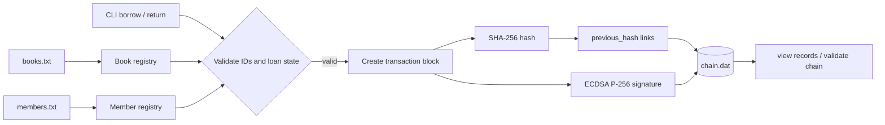

# System Design



## Block structure

```text
index | timestamp | book_id | book_title | member_id | member_name |
action | previous_hash | signature | hash
```

The genesis block has index `0` and a previous hash containing 64 zero characters. Each later block stores the previous block's hash. The hash is calculated over all block fields except the signature and final hash; the ECDSA signature authenticates the same canonical transaction payload. Registry values are copied into the block so later registry edits do not rewrite historical events.
